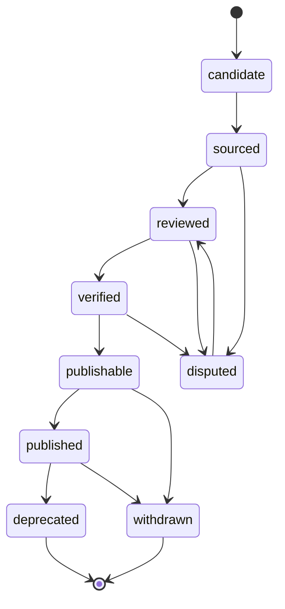

# Claim–Evidence–Source 模型

## 原子链

所有准备发布的事实应可解析为：

`Entity → Claim(subject, predicate, object/value) → Evidence → Source`

Evidence 是“来源中的哪一部分如何支持或反驳”，Source 是“该载体是什么”。一篇论文不是 Evidence 的充分描述；必须记录页码、段落、馆藏对象 ID、数据记录键、时间码或查询/版本定位。

## Claim 最小字段

- 稳定 ID、subject、predicate、object entity 或 typed value；
- 面向用户的陈述文本与语言；
- 时间/地点/适用范围和精度；
- 状态、evidence IDs、counter-evidence IDs；
- disputed 标记与争议说明；
- reviewer、reviewed_at、publish status；
- 完整 `status_history` 和取代/废弃链接。

## 状态机

禁止 `candidate → published`，也禁止仅修改当前状态而没有历史事件。`published` 后的事实修正创建新 Claim 或新版本，并把旧 Claim 标记 `deprecated`；具有法律、权利、安全或严重真实性风险时用 `withdrawn`。

## Evidence

Evidence 记录 `supports / contradicts / contextualizes`、证据种类、来源 ID、精确定位、提取方法、原文语言、必要的短摘录/摘要、适用范围、质量说明和创建时间。计算结果还需输入数据 release、算法/参数版本、可重复性说明；它只能支持计算相似 Claim。

## Source 与 Tier

Source 记录规范 URL、标题、机构/作者、出版/更新日、访问日、类型、Tier、稳定外部 ID、归档/版本、元数据许可、媒体许可、条款核验日和备注。Tier 决定可承担的论证负荷，不能用数量投票替代质量：多个 Tier 3 页面不自动等于 Tier 1。

## 争议与反证

争议 Claim 保留各方命题、对应 Evidence、来源语境和审核说明。UI 不合并为一个“平均答案”；可显示当前策展结论及其限定。传统归属使用 attribution predicate 与置信/状态词，不创建确定作者事实。

`status=disputed` 与 `disputed=true` 必须一致，并要求非空争议说明、review、反证或“目前没有反证记录”的明确理由。公开争议使用 `dispute_display=public_with_notice` 和 `publish_status=disputed_public`；普通 `publishable` 不能掩盖争议。非争议 Claim 强制 `dispute_display=not_disputed`。

## 发布门槛

- 非争议常规事实：至少一个适当 Tier 的 Evidence，经审核且范围清楚。
- 直接影响、身份、归属等高风险事实：Tier 1/2 为主，Tier 3 不得独立承担。
- `publishable` 之前必须有 reviewer、reviewed_at、非空 evidence，所有 source 可解析且没有撤回状态。
- 策展比较可以发布为明确标注的 C 级说明，但不得改变历史 Claim。

Release 验证同时检查正反 Evidence 双向链接与 stance：支持/语境 Evidence 只能出现在 `evidence_ids`，反驳 Evidence 只能出现在 `counter_evidence_ids`。死亡、身份、归属和直接历史关系等高风险 predicate 至少有一个 Tier 1/2 支持来源；`computational_result` 只能支持计算相似 predicate。

任何 `publishable / published / disputed_public` Claim 至少有一个 `stance=supports` 的 Evidence；仅有 `contextualizes` 不构成事实支持。存在 `counter_evidence_ids` 时 Claim 必须进入 `disputed` 状态和对应公开/非公开争议展示流程。Evidence 还必须用稳定 `source_license_bindings.rule_id` 绑定其实际 metadata/data 许可范围，不能只引用 Source 或自由文本选择器。

艺术家生卒 Claim 必须同时匹配 artist subject、受控 predicate、展示值与 datatype；最低作品/正式艺术史记录 Claim 必须指向同一 artist，并有 Tier 1/2 支持。作品归属 Claim 必须匹配 artwork subject 与 creator object；匿名、传统归属和未知作者使用受控 literal，而不是伪造个人端点。

可比较的生卒 year/date 还必须满足出生早于死亡，confirmed-deceased 的死亡日期不得在未来。艺术家关系不能形成自环；`computationally_similar_to` Claim 必须由带算法、版本、输入 release 和参数的 `computational_result` Evidence 支持，普通 scholarly/manual Evidence 只能用于策展比较或历史讨论，不能充当计算结果。
