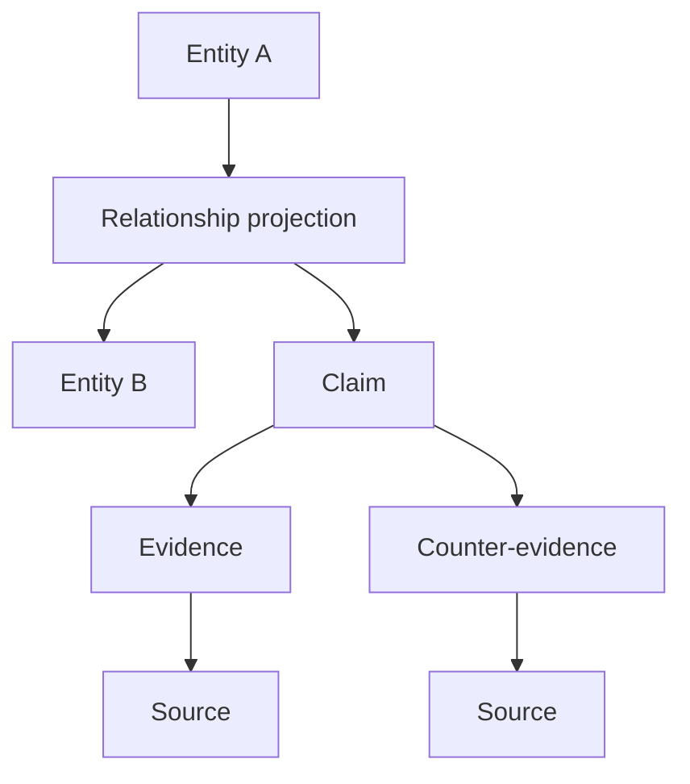

# 知识图谱模型

## 图的含义

节点是稳定 Entity；边是可解释 Relationship 投影；Claim/Evidence/Source 构成每条可发布边的证明子图。图数据库不是必需的真值存储，MVP 以版本化 JSON 构建 Graphology 内存图，便于 GitHub Pages 静态运行。

## 关系记录

每条关系必须包含类型、起终点、方向性、时间/地点范围、A/B/C 证据等级、`evidence_confidence`、来源和 Claim、策展说明、公开展示许可、算法标记、审核状态、schema/data 版本。下列度量互不替代：

- `historical_relationship_strength`：历史互动的范围或持续度；无可靠定义时为 `null`。
- `evidence_confidence`：对已声明关系的证据确信度。
- `computational_similarity`：指定算法和数据版本下的相似度；非算法边为 `null`。
- `curatorial_relevance`：在当前展览问题中的解释价值；不是真值概率。

Schema 强制所有 `is_algorithmic=false` 的边把 `computational_similarity` 设为 `null`；策展比较、计算相似和生物学科关系把艺术史 `historical_relationship_strength` 设为 `null`。需要学科强度时另定义有单位、可审计的分馆字段，不能借用另一语义的槽位。

## 美术馆受控关系词表

| 类别 | 关系类型 | 默认等级/方向 |
|---|---|---|
| 直接历史 | `student_of`, `teacher_of`, `worked_in_studio_of`, `collaborated_with`, `explicitly_influenced_by`, `explicitly_influenced`, `referenced_or_quoted` | A；按语义有向 |
| 组织/语境 | `member_of`, `associated_with_movement`, `participated_in_same_exhibition`, `worked_in_same_place_period`, `shared_patron`, `shared_institution` | B；成员类有向，共现类无向 |
| 比较 | `shared_subject`, `shared_technique`, `shared_material`, `scholarly_compared_with` | C；通常无向，需策展范围 |
| 计算 | `computationally_similar_to` | C；无向、`is_algorithmic=true`、方法版本必填 |

`explicitly_influenced_by` 只接受直接且可定位的 A 级依据；学术作者的比较应是 `scholarly_compared_with`，不能代替艺术家本人的影响承认。反向显示可以由 UI 派生，不能另存成不一致事实。

## A/B/C 证据等级

- **A**：直接接触、师生/合作记录、工作室成员、书信/本人陈述、可靠研究确认的直接关系。
- **B**：同团体、学院、重要展览或时空语境，有历史资料支持但不推出直接影响。
- **C**：策展比较、共享题材/材料/技法或计算相似。展示文案必须使用“比较”“相似”或“共同主题”，禁止因果措辞。

等级是证据种类，不是单一置信分数；一条 A 类证据也可能因归属争议具有较低 `evidence_confidence`。

## 路径

AB 路径是受约束的图查询结果，记录起终点、允许的关系类型/证据等级、是否包含算法边、时间/地点过滤、权重函数、图 release 和算法版本。默认路径按“可解释性优先”排序：少量高证据边、低认知负担、关系类型多样性；不得暗示唯一历史链条。

## 扩展规则

生物交互使用独立词表（捕食、竞争、共生、寄生、传粉、分解等）和行为证据字段。跨馆边只能基于显式 Claim；标签相同、向量相似或布局相近不能自动创建关系。
