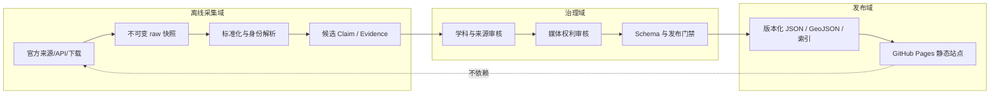

# 总体系统架构

## 架构目标

系统把上游不稳定、许可各异的数据转换为可审核、可回滚、无需上游运行时 API 的博物馆发布快照。架构优化顺序为：证据正确性与权利安全、可访问的探索、上游中断容错、性能，最后才是视觉复杂度。客户端断网可用性属于后续缓存专项，不由静态托管自动保证。



## 五层产品架构

1. **门户层**：分馆入口、全局检索、时间/地点导航、语言、无障碍偏好、未来收藏接口。
2. **分馆层**：`art`、`biology`、`music`、`games`、`civilization`、`arms`、`science`；分馆拥有学科 schema 与展陈规则。`arms` 当前仅登记为门户可见的筹备分馆，尚无 concrete schema，任何实际 arms 数据均由 canonical dispatch 明确阻断。
3. **知识层**：Entity、Relationship、Claim、Evidence、Source、Place、Time Span、Media Asset、Exhibition、Exploration Path、Interactive Module、Dataset Release。
4. **展陈层**：关系视图、时间轴、地图、详情、数字展厅、AB 路径、对比、专题、儿童/深度导览与策展任务。它只读发布数据，不产生事实。
5. **治理层**：来源登记、采集、标准化、去重/消歧、证据绑定、人工审核、权利检查、快照、发布、废弃与撤回。

## 模块边界

| 模块 | 输入 | 输出 | 不负责 |
|---|---|---|---|
| acquisition adapters | 请求配置、上次快照 | 原始响应、HTTP/许可元数据、hash | 决定事实真伪 |
| normalization | raw 快照、映射版本 | 规范候选、冲突集、映射日志 | 丢弃相互冲突的值 |
| identity resolution | 候选、外部 ID、名称/日期 | canonical ID、alias、merge proposal | 无人审时自动合并高风险实体 |
| claim/evidence store | 候选与引用定位 | 有状态 Claim、Evidence、反证 | 将摘要当证据 |
| rights registry | 资产、来源许可、授权 | 逐资产权利结论 | 用项目许可证覆盖第三方内容 |
| release builder | reviewed 数据、schema、权利记录 | manifest + 静态分片 + 索引 | 跳过门禁或联网补齐事实 |
| presentation | 单一 release | 可访问探索体验 | 修改评分、推断关系或调用私密 API |

## 静态发布拓扑

每个 release 是不可变目录：

```text
data/releases/<version>/
  manifest.json
  entities/<branch>/<shard>.json
  relationships/<branch>/<shard>.json
  claims/<shard>.json
  evidence/<shard>.json
  sources.json
  places.geojson
  search/<locale>.json
  withdrawals.json
```

站点构建固定一个 release version，校验所有 hash 后打包。路由、图例、加载失败提示和最小文本目录随应用构建；当前 release 无法读取时显示明确错误，而不是回退到未审核 API。

## 安全、隐私与供应链

- API keys 只存在于本地/Actions secrets，采集产物删除认证头和私人查询参数。
- 外部文本按数据渲染并转义，不执行来源 HTML；URL 使用协议白名单。
- Actions 在 MUSEUM-01 引入时应最小权限并固定第三方 action 版本。
- 构建清单记录工具版本、输入 release、输出 hash；媒体处理不保留不必要 EXIF。
- 本阶段不收集用户账户、收藏或分析数据。未来新增前先做隐私 ADR。

## 伸缩与后端触发

先采用分片、局部子图、预计算索引、懒加载与 CDN/Pages 缓存。只有出现下列需求才评估后端：跨设备私密账户状态、受控授权媒体、频繁协同审核写入、静态索引无法满足的数据规模、需要服务器端保密计算，或发布频率超出静态构建能力。后端不能成为绕开证据/权利门禁的捷径。
